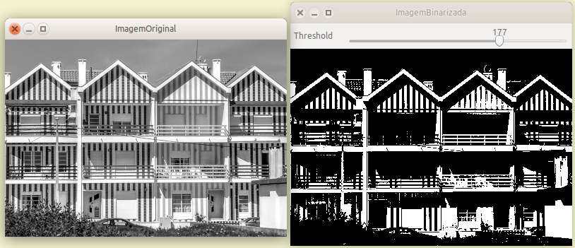
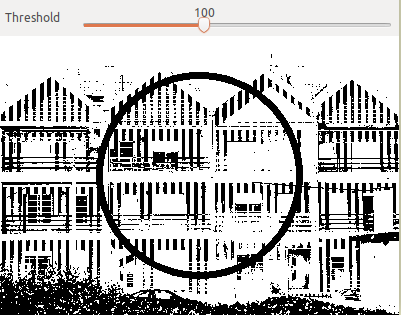
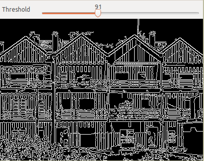

= Aula 5 - PARI

Miguel Riem Oliveira <mriem@ua.pt>
2020-2021

// Instruções especiais para o asciidoc usar icons no output
:icons: html5
:iconsdir: /etc/asciidoc/images/icons

.Sumário
-------------------------------------------------------------
Introdução ao OpenCV.
Apresentação e discussão da metodologia dos Projetos Finais.
-------------------------------------------------------------

O opencv é uma biblioteca muito poderosa para fazer processamento de imagem e visão artificial, entre outras funcionalidades. A partir da versão 3 orientou-se
especialmente para programação em C{plus}{plus} e Python.

Exercício 1 - Introdução ao OpenCV
---------------------------------

6 a)
~~~~

Instalar o openCV no computador.
As packages principais recomendadas:

  sudo apt install libopencv-dev     #(instala automaticamente as dependências)
  sduo apt install opencv-doc	

A versão disponível nos repositórios do Ubuntu (18.04) será possivelmente
a versão 3.2.0 (http://opencv.org/opencv-3-2.html).

Para verificar qual a versão que está instalada no computador pode-se usar:
  
  pkg-config --modversion opencv

ou então:

  dpkg -l | grep libopencv-dev

6 b)
~~~~

Testar o código abaixo em openCV tendo atenção às variáveis 
globais nele presentes, e a outras definições.

O programa espera encontrar o ficheiro `baboon.jpg`
no diretório corrente, mas pode-se usar uma qualquer outra imagem
e, da forma como está o programa, o nome da imagem pode ser passado
na linha de comando.

[source,C]
.Código no ficheiro main.c
--------------------------
#include <stdio.h>
#include "myf.h"

/*Global variables */
int       bin_limitG = 128;                       //initial bin limit
IplImage *src_imageG = NULL, *dst_imageG = NULL;  //notice that they are NULL (not yet initialized)

int main(int argc, char *argv[])
{
//Ex. 4
#if 1
	const char *file_name;

	if( argc > 1) file_name = argv[1];    //if you have arguments use first one as the image file name
	else          file_name = "baboon.jpg";  //else use a default (must be in local dir)

	FirstCvTest(file_name);

#endif
}
--------------------------

[source,C]
.Código no ficheiro header (myf.h)
----------------------------------

#include <opencv2/core/core_c.h>          //core functionalities
#include <opencv2/videoio/videoio_c.h>    //for image aquisition
#include <opencv2/highgui/highgui_c.h>    //for GUI functions

/* Some commmon definitions*/
#define NAME_IMG_ORG "ImagemOriginal"
#define NAME_IMG_PRC "ImagemProcessada"

#include "prototypes.h"
----------------------------------

[source,C]
.Código no ficheiro das funções (myf.c)
----------------------------------------------------------------------
#include "myf.h"

//Variáveis globais (externas)
extern int       bin_limitG;
extern IplImage *src_imageG, *dst_imageG;

int FirstCvTest( const char *f_name)
{
        src_imageG = cvLoadImage(f_name, 0);       /*0 for gray, -1 for color */

        if(!src_imageG)
        {
                printf("Image was not loaded.\n");
                return -1;
        }

        dst_imageG = cvCloneImage(src_imageG);  //create a copy of the image

        cvNamedWindow(NAME_IMG_ORG, 0);   //create a window for original image
        cvNamedWindow(NAME_IMG_PRC, 0);   //create a window for processed image

        cvCreateTrackbar("Threshold", NAME_IMG_PRC, &bin_limitG, 255, ProcessImage);  //create a trackbar to change a parameter
        cvShowImage(NAME_IMG_ORG, src_imageG);                                      //Show the image in created window

        ProcessImage(0);  //to show the first image (the argument is dummy and ignored)

        cvWaitKey(0); //wait for a key to be pressed

        cvReleaseImage(&src_imageG);  //free image memory space
        cvReleaseImage(&dst_imageG);  //free image memory space

        return 0;

}

Exercício 7 - Figura geométrica sobre uma imagem
------------------------------------------------

7 a)
~~~~

Alterar a função anterior para que, sobre a imagem binarizada,
se desenhe adicionalmente uma circunferência de raio igual ao limiar de binarização instantâneo 
(dado pela barra horizontal)
A função em opencv para o fazer é `cvCircle()`
e eis uma sugestão de parâmetros para este programa:

  cvCircle(dst_imageG, cvPoint(dst_imageG->width/2,dst_imageG->height/2 ), bin_limitG, CV_RGB(255,0,0),5,8,0);

7 b)
~~~~

Alterar o código anterior para que a cor da circunferência passe a ser clara, CV_RGB(255,255,255),
quanfo o limiar de binarização for maior que 180 e fique escura, CV_RGB(255,0,0), em
caso contrário. Sugestão: criar uma variável do tipo `CvScalar cor=...` para usar em vez
da macro `CV_RGB()`.

7 c)
~~~

Alterar a função de processamento para efeturar um detetor de arestas de Canny.
A função a usar é `cvCanny()`. Pode-se usar o valor de `bin_limitG` como um dos limiares
de Canny (na imagem exmeplo usou-se o dobro de `bin_limitG`.

Nota: a imagem a processar elo operador de Canny não pode ser a cores (só pode ter um canal).

Exercício 8 - Definição conditional de variáveis globais
---------------------------------------------------------

Incluir as definições globais (Variáveis globais, etc.)
na header file (myf.h) e distinguir a definição da declaração
como externa com definições condicionais de `#ifdef`.
Na myf.h fazer algo do género:

[source,C]
----------------------------------------------------------

#include <opencv2/core/core_c.h>          //core functionalities
#include <opencv2/videoio/videoio_c.h>    //for image aquisition
#include <opencv2/highgui/highgui_c.h>    //for GUI functions

#ifdef _MAIN_C_
	int bin_limitG = 128;
	IplImage *src_imageG = NULL, *dst_imageG = NULL;
#else
	extern int bin_limitG;
	extern IplImage *src_imageG, *dst_imageG;
#endif

#define NAME_IMG_ORG "ImagemOriginal"
#define NAME_IMG_PRC "ImagemProcessada"

#include "prototypes.h"
----------------------------------------------------------

Estas alterações vão obrigar a aguns `#defines` dentro
dos ficheiros source... quais e em que lugares?

